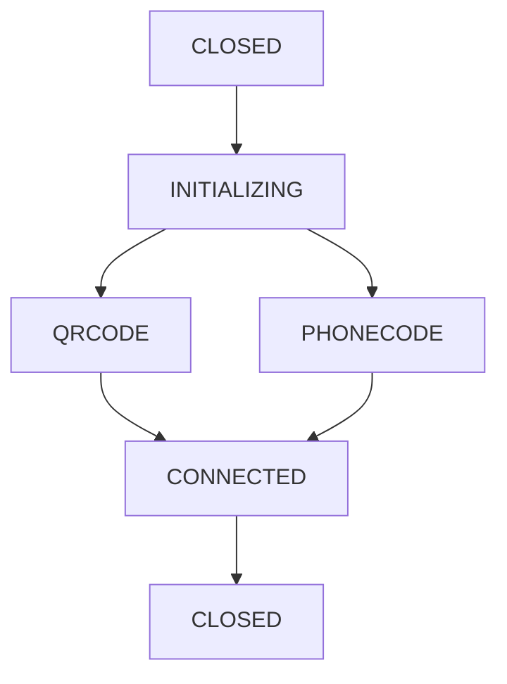

# 🔧 Solucionando Problema do QR Code no Dokploy

## 📋 Problema Identificado

Quando você faz a requisição para `/api/{session}/qrcode-session`, recebe:
```json
{
  "status": "INITIALIZING",
  "message": "QRCode is not available..."
}
```

## 🎯 Causa Raiz

O problema ocorre porque:
1. **Puppeteer não consegue inicializar o Chrome** corretamente no container
2. **Sessão fica presa no status "INITIALIZING"** 
3. **QR Code nunca é gerado** pois o browser não abre

## ✅ Solução Implementada

### 1. **Variáveis de Ambiente no Dokploy**

Configure estas variáveis **obrigatórias** no Dokploy:

```bash
# Puppeteer - ESSENCIAL para funcionar
PUPPETEER_SKIP_CHROMIUM_DOWNLOAD=true
PUPPETEER_EXECUTABLE_PATH=chromium

# Configuração básica
NODE_ENV=production
SECRET_KEY=seu_token_secreto
START_ALL_SESSIONS=false

# Log para debug (temporário)
LOG_LEVEL=info
```

### 2. **Processo Correto para Gerar QR Code**

**❌ NÃO faça assim:**
```bash
# Isso não vai funcionar se a sessão não foi iniciada
GET /api/minha-sessao/qrcode-session
```

**✅ Processo CORRETO:**

**1º Passo - Iniciar a sessão:**
```bash
POST /api/minha-sessao/start-session
Content-Type: application/json
Authorization: Bearer SEU_SECRET_KEY

{
  "waitQrCode": true
}
```

**2º Passo - Aguardar status QRCODE:**
```bash
GET /api/minha-sessao/status-session
```

**3º Passo - Obter QR Code:**
```bash
GET /api/minha-sessao/qr-code
# ou
GET /api/minha-sessao/qrcode-session
```

### 3. **Fluxo de Estados da Sessão**



- **CLOSED**: Sessão não iniciada
- **INITIALIZING**: Iniciando browser (pode demorar 30-60s)
- **QRCODE**: QR Code disponível para escaneio
- **PHONECODE**: Código via SMS (se configurado phone)
- **CONNECTED**: Sessão ativa e funcionando

## 🚀 Como Testar

### 1. **Teste via Postman/Curl:**

```bash
# 1. Iniciar sessão
curl -X POST "https://seu-dominio.com/api/teste/start-session" \
  -H "Content-Type: application/json" \
  -H "Authorization: Bearer SEU_SECRET_KEY" \
  -d '{"waitQrCode": true}'

# 2. Verificar status (aguarde até ser "QRCODE")
curl -X GET "https://seu-dominio.com/api/teste/status-session" \
  -H "Authorization: Bearer SEU_SECRET_KEY"

# 3. Obter QR Code (quando status = "QRCODE")
curl -X GET "https://seu-dominio.com/api/teste/qr-code" \
  -H "Authorization: Bearer SEU_SECRET_KEY"
```

### 2. **Monitorar Logs do Container:**

No Dokploy, acompanhe os logs para ver:
```
info: [teste:browser] Initializing browser...
info: [teste] Status: INITIALIZING
info: [teste] Status: QRCODE
```

## ⚠️ Troubleshooting

### **Se ainda não funcionar:**

1. **Verificar logs de erro:**
```bash
# Procurar por erros como:
# "Failed to launch browser"
# "Chrome crashed"
# "Timeout"
```

2. **Testar manualmente:**
```bash
# No container, testar se chromium funciona:
chromium --version
chromium --no-sandbox --headless --dump-dom https://google.com
```

3. **Aumentar timeout (se necessário):**
```bash
# No Dokploy, adicionar variável:
PUPPETEER_TIMEOUT=60000
```

4. **Forçar reinicialização:**
```bash
# Se a sessão ficar travada:
DELETE /api/teste/logout-session
# Aguardar 30s, depois:
POST /api/teste/start-session
```

## 📚 Endpoints Úteis

```bash
# Status da sessão
GET /api/{session}/status-session

# QR Code como imagem
GET /api/{session}/qr-code

# QR Code como JSON
GET /api/{session}/qrcode-session

# Verificar conexão
GET /api/{session}/check-connection-session

# Encerrar sessão
POST /api/{session}/close-session

# Logout completo
DELETE /api/{session}/logout-session
```

## 🎯 Resumo

O problema do QR Code é **SEMPRE** relacionado ao Puppeteer não conseguir inicializar o Chrome. As alterações no `nixpacks.toml` e `config.ts` resolvem as dependências necessárias. 

**Lembre-se:** 
- ✅ Sempre iniciar a sessão primeiro com `start-session`
- ✅ Aguardar status mudar para "QRCODE" 
- ✅ Só então solicitar o QR Code
- ✅ Monitorar os logs para detectar problemas

Se seguir este processo, o QR Code deve aparecer corretamente! 🎉